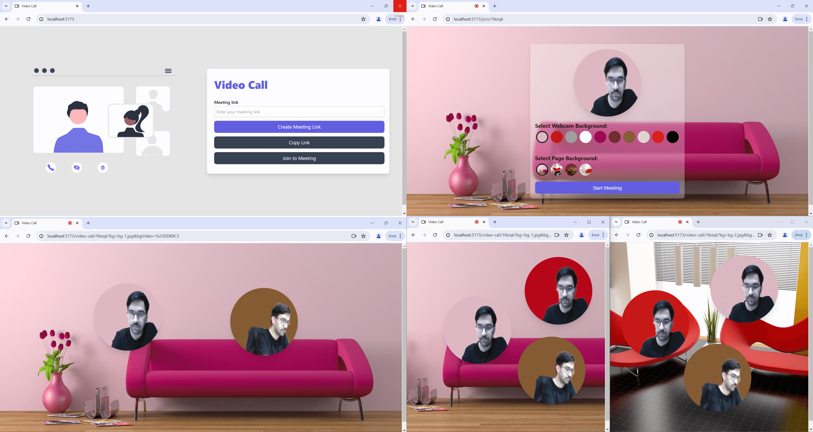

# Video Call App

This is a video call application built with React for the frontend, styled with Tailwind CSS. The backend is built with Node.js, using Socket.IO with Express to facilitate real-time video calls. The app allows users to join video calls, providing functionalities like draggable elements, [background removal](https://www.npmjs.com/package/@mediapipe/selfie_segmentation), and more.

## Screenshot



## Video

[Video](https://github.com/abolfazlbzgh/group-video-call/raw/main/video.mp4)


## Project Structure

### Folder Structure
```arduino
group-video-call/
├── backend/
│ └── server.js
├── frontend/
│ └── src/
│ ├── App.css
│ ├── App.jsx
│ ├── index.css
│ ├── main.jsx
│ ├── Routes.jsx
│ ├── components/
│ │ ├── Button.jsx
│ │ ├── CanvasPeer.jsx
│ │ ├── Frame.jsx
│ │ ├── Input.jsx
│ ├── config/
│ │ └── config.js
│ ├── hooks/
│ │ ├── useDraggable.js
│ │ ├── useVideoStream.js
│ ├── pages/
│ │ ├── Home.jsx
│ │ ├── Join.jsx
│ │ ├── VideoCall.jsx
│ ├── utils/
│ │ ├── backgroundRemove.js
│ │ ├── drawCanvas.js
│ │ ├── MediaStreamService.js
│ │ ├── socketHandlers.js
│ │ └── utils.js
```

### Root Directory

- `backend/`
  - The main source directory for the Node application.

- `frontend/`
  - The main source directory for the React application.

### Backend Code Explanation
The backend of this application is built using Node.js, Express, and Socket.IO, with additional support from CORS and dotenv for environment configuration.

#### Technologies Used

- Node.js: A JavaScript runtime used to build scalable server-side applications.
- Express: A fast, minimalist web framework for Node.js, used to set up the server and handle HTTP requests.
- Socket.IO: A library that enables real-time, bidirectional, and event-based communication between web clients and servers.
- CORS (Cross-Origin Resource Sharing): A mechanism to allow or restrict resources on a web server to be requested from another domain outside the domain from which the resource originated.
- dotenv: A zero-dependency module that loads environment variables from a .env file into process.env.

#### Explanation
1. Environment Configuration: The dotenv library is used to load environment variables from a .env file. This helps in managing configuration settings.

2. Server Setup: An Express application (app) is created and an HTTP server is set up using the http module. This server is then wrapped by a Socket.IO server to enable real-time communication.

3. CORS Middleware: The Express application uses the cors middleware to enable Cross-Origin Resource Sharing, allowing the server to accept requests from any origin.

4. Rooms Management: The server maintains an in-memory object (rooms) to track users in different rooms. Each room is identified by a unique roomId.

5. Socket.IO Connection: When a client connects to the server via Socket.IO, the server logs the connection and listens for various events such as:
    - join-room: When a user joins a room, their socket ID and username are stored in the rooms object. The user is then added to the specified room, and other users in the room are notified.
    - disconnect: When a user disconnects, they are removed from the room. If the room becomes empty, it is deleted.
    - send-offer: Handles the event where a user sends an offer to another user for establishing a WebRTC connection.
    - send-answer: Handles the event where a user sends an answer in response to an offer.
    - send-ice-candidate: Handles the event where a user sends ICE candidates required for WebRTC connections.
6. Server Listening: The server listens on a specified port (defaulting to 5000 if not provided via environment variables) and logs a message indicating that it is running.

### Frontend Code Explanation

- `App.css`
  - Global styles for the application.

- `App.jsx`
  - Main application component that sets up the routes and general structure of the app.

- `index.css`
  - Global CSS imports and Tailwind CSS setup.

- `main.jsx`
  - Entry point of the React application. Renders the `App` component.

- `Routes.jsx`
  - Defines the routes for the application using `react-router-dom`.

### Directories

#### `components/`
Contains reusable React components.

- `Button.jsx`
  - A reusable button component.
  
- `CanvasPeer.jsx`
  - Manages the video stream for a peer in the video call. Handles the video canvas and related functionalities.

- `Frame.jsx`
  - Component for displaying a video frame. Can be used to encapsulate video elements with a consistent style.

- `Input.jsx`
  - A reusable input component. Can be used for forms and user input throughout the application.

#### `config/`
Contains configuration files.

- `config.js`
  - Configuration settings for the application, such as Port of API endpoints

#### `hooks/`
Contains custom React hooks.

- `useDraggable.js`
  - Hook for making elements draggable. Provides logic to enable dragging of UI elements within the application.

- `useVideoStream.js`
  - Hook for handling video stream logic. Manages the initialization and cleanup of media streams.

#### `pages/`
Contains the main page components.

- `Home.jsx`
  - The home page of the application. Typically includes a welcome message and options to navigate to other parts of the app.

- `Join.jsx`
  - The page where users can join a video call by entering a room ID. Includes a form for room ID input.

- `VideoCall.jsx`
  - The main video call interface. Manages the video call session, displays video streams, and includes call controls.

#### `utils/`
Contains utility functions and services.

- `backgroundRemove.js`
  - Utility for removing the background from a video stream. Uses a [machine learning model](https://www.npmjs.com/package/@mediapipe/selfie_segmentation) to detect and remove the background of a video feed.

- `drawCanvas.js`
  - Utility for drawing on a canvas element. Provides functions to render shapes, text, or other graphics onto an HTML canvas.

- `MediaStreamService.js`
  - Service for handling media stream-related functionalities. Manages the acquisition of media streams from user devices (e.g., camera, microphone), and provides functions to manipulate these streams.

- `socketHandlers.js`
  - Handlers for managing socket events. Defines functions to handle real-time communication events such as connecting, disconnecting, and exchanging messages or data.

- `utils.js`
  - General utility functions. Contains helper functions used throughout the application for various purposes.

## Getting Started

### Prerequisites

- Node.js
- npm

### Installation

1. Clone the repository:
   ```bash
   git clone https://github.com/abolfazlbzgh/group-video-call.git
   ```
2. Navigate to the project directory:
   ```bash
   cd group-video-call
   ```
### Running the Application

1. First, navigate to the backend directory and start the backend server:

   ```bash
   cd backend
   npm install
   node start
   ```
   The backend uses Socket.IO with Express to manage real-time video calls.

2. In a separate terminal, navigate to the frontend directory and start the development server:

   ```bash
   cd ../frontend
   npm install
   npm run dev
   ```
The frontend application will be available at [http://localhost:5173](http://localhost:5173), and the backend server will run as specified in your configuration.

## Usage

1. Open the application in your browser.
2. Enter a room ID to join a video call.
3. Use the draggable elements and other functionalities as needed.

## License

This project is licensed under the MIT License. See the [LICENSE](./LICENSE.txt) file for details.
